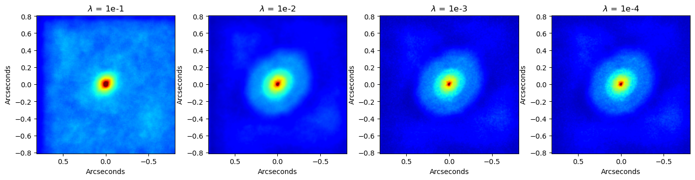

# ALMA DIP — Deep Image Prior for Radio Interferometric Imaging

Reconstruct radio-astronomical images directly from ALMA visibility data using
a **Deep Image Prior** (DIP) U-Net generator, a **Student-t** data-fidelity
loss for outlier robustness, and **bootstrap resampling** for per-pixel
uncertainty estimation.

---

## Example output



*Reconstructed images of the proto-planetary disk around DG Tau using ALMA-DIP. Different values of the total-variation regularizer were tested. The value of the hyperparameter is labeled on each panel. Notice the effect of the regularization over the image structure.*

---

## How it works

```
Visibility data (u, v, Re, Im, w)
           │
           ▼
  ┌─────────────────────┐
  │   reconstruct_dip   │  ← picks small or memory path automatically
  └─────────────────────┘
     │                │
     ▼                ▼
  Small path      Memory path
  (full trig      (mini-batch +
   tables)         SNIS sampler)
     │                │
     └────────┬───────┘
              ▼
       DIPUNet (U-Net generator)
       StudentTLoss (data fidelity)
       TV regularisation
              │
              ▼
       Reconstructed image
              │
              ▼
  bootstrap_reconstruct  (B replicates)
              │
              ▼
   mean / std / p16 / p84  maps
```

**Two computation paths are selected automatically** based on the number of
visibilities N:

| Path | When used | Memory cost |
|------|-----------|-------------|
| Small | N ≤ `auto_threshold_n` (default 5 M) | O(N × max(H, W)) |
| Memory | N > `auto_threshold_n` | O(batch_vis × max(H, W)) |

---

## Quick start

### 1. Install dependencies

```bash
pip install -r requirements.txt
```

> **Apple Silicon (MPS):** PyTorch ships with MPS support out of the box since
> v2.0.  No extra steps needed.

### 2. Run the reconstruction

```bash
python run_alma_dip_bootstrapping.py
```

This reads `DG_Tau.txt` and writes the following FITS files:

| File | Contents |
|------|----------|
| `DG_Tau_dip_image.fits` | DIP reconstructed intensity |
| `DG_Tau_dip_dirty.fits` | Dirty (back-projected) image |
| `DG_Tau_dip_beam.fits` | Point spread function (PSF) |
| `DG_Tau_bootstrap_mean.fits` | Bootstrap pixel mean |
| `DG_Tau_bootstrap_std.fits` | Bootstrap pixel std (1σ uncertainty) |
| `DG_Tau_bootstrap_p16.fits` | 16th-percentile map |
| `DG_Tau_bootstrap_p84.fits` | 84th-percentile map |

---

## Input data format

`DG_Tau.txt` — whitespace-delimited, first row is a header:

```
u   v   Re   Im   weight
...
```

All columns are `float32`.  Baseline coordinates `(u, v)` are in wavelengths.

---

## Key configuration knobs

Edit `run_alma_dip_bootstrapping.py` to change `DIPConfig`:

| Parameter | Default | Effect |
|-----------|---------|--------|
| `num_iters` | 1800 | Gradient steps per reconstruction |
| `lr` | 1e-3 | Adam learning rate |
| `tv_weight` | 1e-2 | TV regularisation (higher → smoother) |
| `cell_size_arcsec` | 0.003 | Pixel scale in arcseconds |
| `nu` | 3.0 | Student-t d.o.f. (lower → heavier tails) |
| `force_mode` | `"auto"` | `"auto"` / `"small"` / `"memory"` |
| `auto_threshold_n` | 5 000 000 | N threshold for path selection |
| `batch_vis` | 16384 | Mini-batch size (memory path only) |
| `B` *(in runner)* | 20 | Number of bootstrap replicates |
| `method` *(in runner)* | `"poisson"` | Bootstrap scheme (`"poisson"` or `"bayesian"`) |

For a **quick test run** set `num_iters=200`, `out_every=50`, `B=3`.

---

## Changing the compute device

```python
device = str(pick_device("mps"))   # Apple Silicon GPU
device = str(pick_device("cuda"))  # NVIDIA GPU
device = str(pick_device("cpu"))   # CPU fallback
device = str(pick_device())        # auto-detect: MPS → CUDA → CPU
```

---

## Repository layout

```
.
├── alma_dip_bootstrapping.py   # Core library (all classes and functions)
├── run_alma_dip_bootstrapping.py  # Entry point / configuration
├── DG_Tau.txt                  # ALMA visibility data (example dataset)
├── requirements.txt
└── README.md
```

---

## Dependencies

- [PyTorch](https://pytorch.org/) ≥ 2.0
- [NumPy](https://numpy.org/) ≥ 1.24
- [Astropy](https://www.astropy.org/) ≥ 5.3 (FITS I/O)

---

## Acknowledgement

This research has been done with the support of the Mexican Secretaría de Ciencia, Humanidades, Tecnología e Innovación (SECIHTI) under the project CBF 2025-I-3033.
